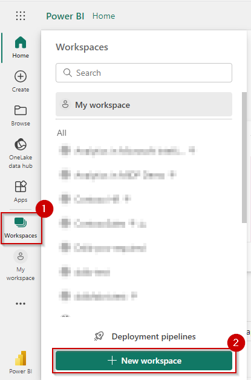
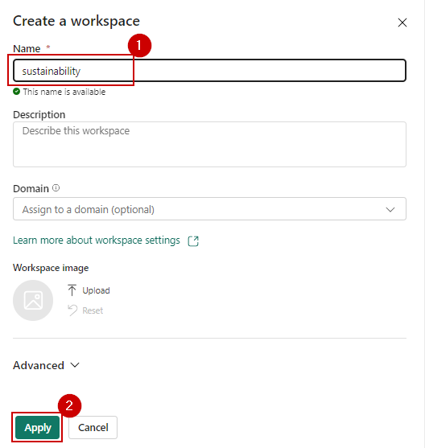
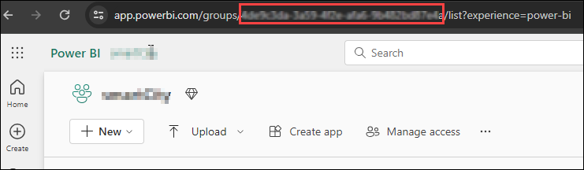
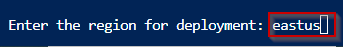

## What is DPoC?
DREAM PoC Accelerators (DPoC) are packaged DREAM Demos using ARM templates and automation scripts (with a demo web application, Power BI reports, Fabric resources, Azure OpenAI services, ML Notebooks etc.) that can be deployed in a customer’s Azure environment.

## Objective & Intent
Partners can deploy DREAM Demos in their own Azure subscriptions and demonstrate them live to their customers. 
Partnering with Microsoft sellers, partners can deploy the Industry scenario DREAM demos into customer subscriptions. 
Customers can play, get hands-on experience navigating through the demo environment in their own subscription and show it to their own stakeholders.

**Here are some important guidelines before you begin** 

1. **Read the [license agreement](/license.md) and [disclaimer](/disclaimer.md) before proceeding, as your access to and use of the code made available hereunder is subject to the terms and conditions made available therein.**
2. Without limiting the terms of the [license](/license.md) , any Partner distribution of the Software (whether directly or indirectly) must be conducted through Microsoft’s Customer Acceleration Portal for Engagements (“CAPE”). CAPE is accessible to Microsoft employees. For more information aregarding the CAPE process, contact your local Data & AI specialist or CSA/GBB.
3. It is important to note that **Azure hosting costs** are involved when DREAM PoC Accelerator is implemented in customer or partner Azure subscriptions. DPoC hosting costs are not covered by Microsoft for partners or customers.
4. Since this is a DPoC, there are certain resources available to the public. **Please ensure that proper security practices are followed before adding any sensitive data to the environment.** To strengthen the environment's security posture, **leverage Azure Security Centre.** 
5.  In case of questions or comments; please email **[dreamdemos@microsoft.com](mailto:dreamdemos@microsoft.com).**

## Disclaimer
**This is a demonstration showing the art of the possible. Note that there is currently no Azure OpenAI service implementation in this demo.**

## Optional Prerequisite
**MCFS (Setup):** [Cloud for Sustainability API (preview) overview - Microsoft Cloud for Sustainability | Microsoft Learn](https://learn.microsoft.com/en-us/industry/sustainability/api-overview?WT.mc_id=industry_inproduct_solncenterSustainability#configure-data-sources-and-enable-the-apis)

**MSM:**
- You should have Microsoft Sustainability Manager installed and set up in your Dataverse environment.
- You should have a Azure Data Lake Storage Gen2 storage account.
- Dataverse: You must have the Dataverse system administrator security role.
- Azure Data Lake Storage Gen2: You must have an Azure Data Lake Storage Gen2 account and Owner and Storage Blob Data Contributor role access. Your storage account must enable Hierarchical namespace for both initial setup and delta sync. Allow storage account key access is required only for the initial setup.

## Contents

<!-- TOC -->

- [Requirements](#requirements)
- [Before Starting](#before-starting)
  - [Task 1: Power BI Workspace creation](#task-1-power-bi-workspace-creation)
  - [Task 2: Run the Cloud Shell to provision the demo resources](#task-2-run-the-cloud-shell-to-provision-the-demo-resources)

<!-- /TOC -->

## Requirements

* A Power BI with Fabric License to host Power BI reports.
* Make sure your Power BI administrator can provide service principal access on your Power BI tenant.
* Make sure to register the following resource providers with your Azure Subscription:
   - Microsoft.Fabric
   - Microsoft.StorageAccount
   - Microsoft.AppService
   - Microsoft.CognitiveServices
* You must only execute one deployment at a time and wait for its completion. Running multiple deployments simultaneously is highly discouraged, as it can lead to deployment failures.
* Select a region where the desired Azure Services are available. If certain services are not available, deployment may fail. See [Azure Services Global Availability](https://azure.microsoft.com/en-us/global-infrastructure/services/?products=all) for understanding target service availability.
* In this Accelerator, we have converted real-time reports into static reports for the users' ease but have covered the entire process to configure real-time dataset. Using those real-time dataset, you can create real-time reports.
* Make sure you use the same valid credentials to log into Azure and Power BI.
* Make sure that you have Contributor permissions on the subscription.
* Review the [License Agreement](/license.md) before proceeding.

### Task 1: Power BI Workspace creation

1. **Open** Power BI in a new tab by clicking [HERE](https://app.powerbi.com/)

2. **Sign in** to Power BI.

	

	> **Note:** Use your Azure Active Directory credentials to login to Power BI.

3. In Power BI service **click** 'Workspaces'.

4. **Click** '+ New workspace' button.

	

5. **Enter** the name as 'sustainability' and **click** 'Apply'.

>**Note:** The name of the workspace should be in camel case, i.e. the first word starting with a small letter and then the second word staring with a capital letter with no spaces in between.

>If name 'sustainability' is already taken, add some suffix to the end of the name for eg. 'sustainabilityTest'.

>Workspace name should not have any spaces.

   

6. **Copy** the Workspace GUID or ID from the address URL.

7. **Save** the GUID in a notepad for future reference.

	

	> **Note:** This workspace ID will be used during powershell script execution.

8. In the workspace **click** the three dots(Ellipsis) and **select** 'Workspace settings'.

	

9. In the left pane of the side bar **click** 'Premium', scroll down and **check** the 'Fabric capacity' radio box.

	

10. **Scroll down** and **click** on 'Apply'.

	


### Task 2: Run the Cloud Shell to provision the demo resources

>**Note:** For this Demo we have assets in an Azure resource group as well as Fabric Workspaces

>**Note:** In this task we will execute a powershell script on 'Cloudshell' to create those assets

>**Note:** List of the resources are as follows:

**Azure resources:**
|NAME	|TYPE|
|-----|-----|
|app-sustainability-{suffix}	|Microsoft.Web/sites	|
|asp-sustainability-{suffix}	|Microsoft.Web/serverFarms	|
|stsustainability{suffix}	|Microsoft.Storage/storageAccounts	|
|speech-service-{suffix}	|Microsoft.CognitiveServices/accounts	|
| | |


**Fabric resources:**
| DisplayName | Type |
|-----------|------|
| lakehouseBronze{suffix} |                                         Lakehouse |
| lakehouseSilver{suffix} |                                           Lakehouse |
| lakehouseGold{suffix} |                                             Lakehouse |
| lakehouseBronze{suffix} |                                           SQLEndpoint |
| lakehouseSilver{suffix} |                                           SQLEndpoint |
| lakehouseGold{suffix} |                                             SQLEndpoint |
| lakehouseBronze{suffix} |                                           SemanticModel |
| lakehouseSilver{suffix} |                                         SemanticModel |
| lakehouseGold{suffix} |                                         SemanticModel |
| 01_Load_Transform_MSM_CSVToParquet_Into_Bronze_Layer.ipynb |       Notebook |
| 02_Load_Parquet_Files_Into_Lakehouse_Bronze_Tables.ipynb |        Notebook |
| 03_Transform_MSM_Data_To_ESG_Data_Model.ipynb |                    Notebook |
| 04_Load_ESG_Model_Data_Into_Silver_Layer.ipynb |                  Notebook |
| 05_Social_And_Governance_ESG_Aggregated_Data_To_Gold_Layer.ipynb | Notebook |
| 06_Waste_Aggregated_Data_To_Gold_Layer.ipynb  |                   Notebook |
| 07_Social_Governance_Aggregated_Data_To_Gold_Layer.ipynb   |      Notebook |
| 08_Azure_Usage_And_Emission_Data_To_Lakehouse.ipynb    |          Notebook |
| 09_CO2_Emission_Forecasting_using_ARIMA.ipynb     |               Notebook |
| MCFS_Azure_Data.ipynb      |                                      Notebook |
| Water_Quality_Prediction_A_Data_Driven_Approach.ipynb       |     Notebook |
| 01_World Map KPIs Sustainability       |                          Report |
| 03_Carbon Emission Assessment Plan                  |             Report |
| 05_Sales Demand and Greenhouse Gas Emissions Report   |           Report |
| 06_Transport Deep Dive      |                                     Report |
| 08_ESG Waste Contoso    |                                         Report |
| 09_ESG Waste Litware Acquisition |                                Report |
| 10_ESG Water Litware      |                                       Report |
| 11_Social & Governance Training      |                            Report |
| 12_Workforce Health & Safety         |                            Report |
| 13_Co2 Emissions Forecast        |                                Report |
| 15_Group CEO KPI              |                                   Report |
| 20_ESGWaste_Litware |                                              Report |
| 01_World Map KPIs Sustainability                |                 SemanticModel |
| 03_Carbon Emission Assessment Plan                           |    SemanticModel |
| 05_Sales Demand and Greenhouse Gas Emissions Report  |            SemanticModel |
| 06_Transport Deep Dive     |                                      SemanticModel |
| 08_ESG Waste Contoso   |                                          SemanticModel |
| 09_ESG Waste Litware Acquisition |                                 SemanticModel |
| 10_ESG Water Litware      |                                       SemanticModel |
| 11_Social & Governance Training      |                            SemanticModel |
| 12_Workforce Health & Safety         |                            SemanticModel |
| 13_Co2 Emissions Forecast        |                                SemanticModel |
| 15_Group CEO KPI              |                                   SemanticModel |
| 20_ESGWaste_Litware |                                             SemanticModel |
| | |


1. **Open** Azure Portal by clicking [HERE](https://portal.azure.com/)

2. In the Resource group section, **select** the Terminal icon to open Azure Cloud Shell.

	

3. **Click** on the 'PowerShell'.

	

4. **Select** the 'No storage account required' radio button.

5. **Select** your subscription.

6. **Click** on the 'Apply' button.

	

7. **Enter** the following command to clone the repository files in cloudshell.

Command:
```
git clone -b sustainability2.0 --depth 1 --single-branch https://github.com/microsoft/Azure-Analytics-and-AI-Engagement.git sustainability
```

   
	
> **Note:** If you get File already exist error, please execute the following command to delete existing clone and then reclone:

```
 rm sustainability -r -f 
```

> **Note**: When executing scripts, it is important to let them run to completion. Some tasks may take longer than others to run. When a script completes execution, you will be returned to a command prompt. 

8. **Enter** the password for cloning the repo.

	

9. **Execute** the Powershell script with the following command:
```
cd ./sustainability
```

```
./sustainabilitySetup.ps1
```
    
   
      
10. From the Azure Cloud Shell, **copy** the authentication code. You will need to enter this code in next step.

11. **Click** the link [https://microsoft.com/devicelogin](https://microsoft.com/devicelogin) and a new browser window will launch.

	
     
12. **Paste** the authentication code.

	

13. **Select** the user account that is used for logging into the Azure Portal in [Task 1](#task-1-create-a-resource-group-in-azure).

	

14. **Click** on 'Continue' button.

	

15. **Close** the browser tab once you see the message box.

	  

16. **Navigate back** to your Azure Cloud Shell execution window.

17. **Enter** your 'current working subscription' from the list of available subscriptions and **click** on the 'Enter' key.

	  

18. **Copy** the code on screen to authenticate Azure PowerShell script for creating reports in Power BI.

19. **Click** the link [https://microsoft.com/devicelogin](https://microsoft.com/devicelogin).

	

20. A new browser window will launch.

21. **Paste** the authentication code you copied from the shell above.

	

22. **Select** the user account that is used for logging into the Azure Portal in [Task 1](#task-1-create-a-resource-group-in-azure).

	

23. **Click** on the 'Continue' button.

	

24. **Close** the browser tab once you see the message box.

	

25. **Go back** to Azure Cloud Shell execution window.

26. From the Azure Cloud Shell, **copy** the authentication code. You will need to enter this code in next step.

27. **Click** the link [https://microsoft.com/devicelogin](https://microsoft.com/devicelogin) and a new browser window will launch.

	
     
28. **Paste** the authentication code.

	

29. **Select** the user account that is used for logging into the Azure Portal in [Task 1](#task-1-create-a-resource-group-in-azure).

	

30. **Click** on 'Continue' button.

	

31. **Close** the browser tab once you see the message box.

	  

32. **Navigate back** to your Azure Cloud Shell execution window.

33. **Enter** the Region for deployment with necessary resources available, preferably "eastus". (ex. eastus, eastus2, westus, westus2 etc)

	

34. **Enter** the workspace id which you copied in Step 6 of [Task 1](#task-1-power-bi-workspace-and-lakehouse-creation).

	

	> **Note:** The deployment will take approximately 10-15 minutes to complete. Keep checking the progress with messages printed in the console to avoid timeout.

35. After the script execution is complete, the user is prompted "--Execution Complete--"

>**Note:** The screenshot below shows how the resources would look like:

**Azure Resource Group:**

  

**Fabric Workspace:**

  


# Copyright

© 2023 Microsoft Corporation. All rights reserved.   

By using this demo/lab, you agree to the following terms: 

The technology/functionality described in this demo/lab is provided by Microsoft Corporation for purposes of obtaining your feedback and to provide you with a learning experience. You may only use the demo/lab to evaluate such technology features and functionality and provide feedback to Microsoft.  You may not use it for any other purpose. You may not modify, copy, distribute, transmit, display, perform, reproduce, publish, license, create derivative works from, transfer, or sell this demo/lab or any portion thereof. 

COPYING OR REPRODUCTION OF THE DEMO/LAB (OR ANY PORTION OF IT) TO ANY OTHER SERVER OR LOCATION FOR FURTHER REPRODUCTION OR REDISTRIBUTION IS EXPRESSLY PROHIBITED. 

THIS DEMO/LAB PROVIDES CERTAIN SOFTWARE TECHNOLOGY/PRODUCT FEATURES AND FUNCTIONALITY, INCLUDING POTENTIAL NEW FEATURES AND CONCEPTS, IN A SIMULATED ENVIRONMENT WITHOUT COMPLEX SET-UP OR INSTALLATION FOR THE PURPOSE DESCRIBED ABOVE. THE TECHNOLOGY/CONCEPTS REPRESENTED IN THIS DEMO/LAB MAY NOT REPRESENT FULL FEATURE FUNCTIONALITY AND MAY NOT WORK THE WAY A FINAL VERSION MAY WORK. WE ALSO MAY NOT RELEASE A FINAL VERSION OF SUCH FEATURES OR CONCEPTS.  YOUR EXPERIENCE WITH USING SUCH FEATURES AND FUNCITONALITY IN A PHYSICAL ENVIRONMENT MAY ALSO BE DIFFERENT.

