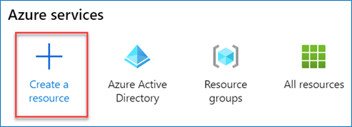
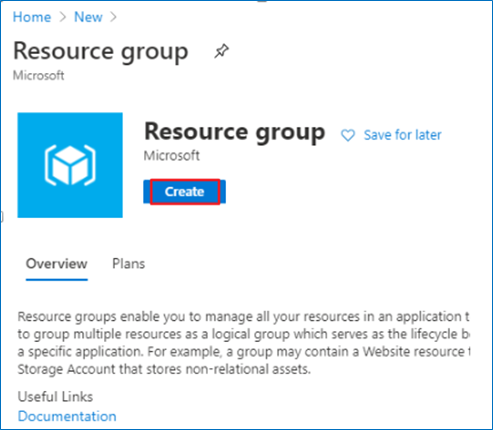
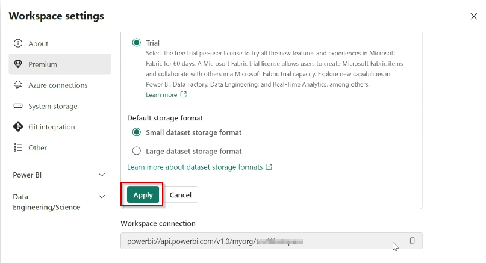
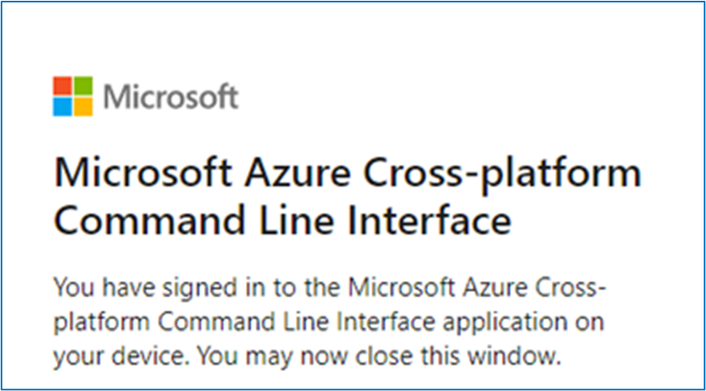
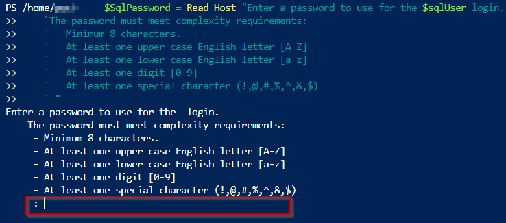
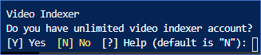
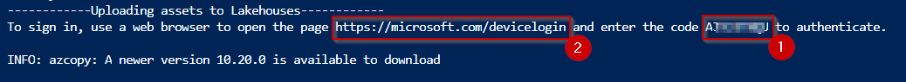

# Sustainability DREAM Demo in a Box Setup Guide

## What is it?
DREAM Demos in a Box (DDiB) are packaged Industry Scenario DREAM Demos with ARM templates (with a demo web app, Power BI reports, Synapse resources, AML Notebooks etc.) that can be deployed in a customer’s subscription using the CAPE tool in a few hours.  Partners can also deploy DREAM Demos in their own subscriptions using DDiB.

 ## Objective & Intent
Partners can deploy DREAM Demos in their own Azure subscriptions and show live demos to customers. 
In partnership with Microsoft sellers, partners can deploy the Industry scenario DREAM demos into customer subscriptions. 
Customers can play,  get hands-on experience navigating through the demo environment in their own subscription and show to their own stakeholders.
**Before You Begin**

## :exclamation:IMPORTANT NOTES:  

  1. **Please read the [license agreement](https://github.com/microsoft/Azure-Analytics-and-AI-Engagement/blob/main/CDP-Retail/license.md) and [disclaimer](https://github.com/microsoft/Azure-Analytics-and-AI-Engagement/blob/main/CDP-Retail/disclaimer.md) before proceeding, as your access to and use of the code made available hereunder is subject to the terms and conditions made available therein.**
  2. Without limiting the terms of the [license](https://github.com/microsoft/Azure-Analytics-and-AI-Engagement/blob/main/CDP-Retail/license.md) , any Partner distribution of the Software (whether directly or indirectly) may only be made through Microsoft’s Customer Acceleration Portal for Engagements (“CAPE”). CAPE is accessible by Microsoft employees. For more information about the CAPE process, please connect with your local Data & AI specialist or CSA/GBB.
  3. Please note that **Azure hosting costs** are involved when DREAM Demos in a Box are implemented in customer or partner Azure subscriptions. **Microsoft will not cover** DDiB hosting costs for partners or customers.
  4. Since this is a DDiB, there are certain resources open to the public. **Please ensure proper security practices are followed before you add any sensitive data into the environment.** To strengthen the security posture of the environment, **leverage Azure Security Centre.** 
  5.  For any questions or comments please email **[dreamdemos@microsoft.com](mailto:dreamdemos@microsoft.com).**
  
   > **Note**: Set up your demo environment at least two hours before your scheduled demo to make sure everything is working.
   
# Copyright

© 2021 Microsoft Corporation. All rights reserved.   

By using this demo/lab, you agree to the following terms: 

The technology/functionality described in this demo/lab is provided by Microsoft Corporation for purposes of obtaining your feedback and to provide you with a learning experience. You may only use the demo/lab to evaluate such technology features and functionality and provide feedback to Microsoft.  You may not use it for any other purpose. You may not modify, copy, distribute, transmit, display, perform, reproduce, publish, license, create derivative works from, transfer, or sell this demo/lab or any portion thereof. 

COPYING OR REPRODUCTION OF THE DEMO/LAB (OR ANY PORTION OF IT) TO ANY OTHER SERVER OR LOCATION FOR FURTHER REPRODUCTION OR REDISTRIBUTION IS EXPRESSLY PROHIBITED. 

THIS DEMO/LAB PROVIDES CERTAIN SOFTWARE TECHNOLOGY/PRODUCT FEATURES AND FUNCTIONALITY, INCLUDING POTENTIAL NEW FEATURES AND CONCEPTS, IN A SIMULATED ENVIRONMENT WITHOUT COMPLEX SET-UP OR INSTALLATION FOR THE PURPOSE DESCRIBED ABOVE. THE TECHNOLOGY/CONCEPTS REPRESENTED IN THIS DEMO/LAB MAY NOT REPRESENT FULL FEATURE FUNCTIONALITY AND MAY NOT WORK THE WAY A FINAL VERSION MAY WORK. WE ALSO MAY NOT RELEASE A FINAL VERSION OF SUCH FEATURES OR CONCEPTS.  YOUR EXPERIENCE WITH USING SUCH FEATURES AND FUNCITONALITY IN A PHYSICAL ENVIRONMENT MAY ALSO BE DIFFERENT.

## Contents

<!-- TOC -->

- [Requirements](#requirements)
- [Before Starting](#before-starting)
  - [Task 1: Create a resource group in Azure](#task-1-create-a-resource-group-in-azure)
  - [Task 2: Power BI Workspace creation](#task-2-power-bi-workspace-creation)
  - [Task 3: Deploy the ARM Template](#task-3-deploy-the-arm-template)
  - [Task 4: Run the Cloud Shell to provision the demo resources](#task-4-run-the-cloud-shell-to-provision-the-demo-resources)
  - [Task 5: Power BI reports and dashboard creation](#task-5-power-bi-reports-and-dashboard-creation)
  	- [Steps to validate the credentials for reports](#steps-to-validate-the-credentials-for-reports)
  	- [Steps to create realtime reports](#steps-to-create-realtime-reports)
  	- [Follow these steps to create the Power BI dashboard](#follow-these-steps-to-create-the-power-bi-dashboard)
  	- [Updating Dashboard and Report Ids in Web app](#updating-dashboard-and-report-ids-in-web-app)
  - [Task 6: Pause or Resume script](#task-6-pause-or-resume-script)
  - [Task 7: Clean up resources](#task-7-clean-up-resources)

<!-- /TOC -->

## Requirements

* An Azure Account with the ability to create an Azure Synapse Workspace.
* A Power BI Pro or Premium account to host Power BI reports.
* Make sure you are the Power BI administrator for your account and service principal access is enabled on your Power BI tenant.
* Make sure the following resource providers are registered with your Azure Subscription.
   - Microsoft.Sql 
   - Microsoft.Synapse 
   - Microsoft.StreamAnalytics 
   - Microsoft.EventHub 
   - Microsoft.Media.MediaServices
* You can run only one deployment at any point in time and need to wait for its completion. You should not run multiple deployments in parallel as that will cause deployment failures.
* Select a region where the desired Azure Services are available. If certain services are not available, deployment may fail. See [Azure Services Global Availability](https://azure.microsoft.com/en-us/global-infrastructure/services/?products=all) for understanding target service availability. (consider the region availability for Synapse workspace, Iot Central and cognitive services while choosing a location.)
* Do not use any special characters or uppercase letters in the environment code. Also, do not re-use your environment code.
* In this Accelerator we have converted real-time reports into static reports for the ease of users but have covered entire process to configure realtime dataset. Using those realtime dataset you can create realtime reports.
* Please ensure that you select the correct resource group name. We have given a sample name which may need to be changed should any resource group with the same name already exist in your subscription.
* The audience for this document is CSAs and GBBs.
* Please log in to Azure and Power BI using the same credentials.
* Once the resources have been setup, please ensure that your AD user and synapse workspace have “Storage Blob Data Owner” role assigned on storage account name starting with “stsustainability”. You need to contact AD admin to get this done.
* Please review the [License Agreement](https://github.com/microsoft/Azure-Analytics-and-AI-Engagement/blob/main/CDP-Retail/license.md) before proceeding.

## Before starting

### Task 1: Create a resource group in Azure

1. **Log into** the [Azure Portal](https://portal.azure.com) using your Azure credentials.

2. On the Azure Portal home screen, **select** the '+ Create a resource' tile.

	

3. In the Search the Marketplace text box, **type** "Resource Group" and **press** the Enter key.

	

4. **Select** the 'Create' button on the 'Resource Group' overview page.

	
	
5. On the 'Create a resource group' screen, **select** your desired subscription. For Resource group, **type** 'DDiB-Sustainability-Lab'. 

6. **Select** your desired region.

	> **Note:** Some services behave differently in different regions and may break some part of the setup. Choosing one of the following regions is preferable: 		westus2, eastus2, northcentralus, northeurope, southeastasia, australliaeast, centralindia, uksouth, japaneast.

7. **Click** the 'Review + create' button.

	

8. **Click** the 'Create' button once all entries have been validated.

	

### Task 2: Power BI Workspace creation

1. **Open** Power BI in a new tab using the following link:  [https://app.powerbi.com/](https://app.powerbi.com/)

2. **Sign in** to Power BI using your Power BI Pro account.

	

	> **Note:** Use the same credentials for Power BI which you will be using for the Azure account.

3. In Power BI service **Click** on 'Workspaces'.

4. Then **click** on the 'Create a workspace' tab.

	

	> **Note:** Please create a Workspace by the name "DDiB-Sustainability".

5. **Copy** the Workspace GUID or ID. You can get this by browsing to [https://app.powerbi.com/](https://app.powerbi.com/), selecting the workspace, and then copying the GUID 	from the address URL.

6. **Paste** the GUID in a notepad for future reference.

	

	> **Note:** This workspace ID will be used during ARM template deployment.

7. Go to your Power BI **workspace** and **click** on New button. 

8. Then **click** on **Streaming Dataset** option from the dropdown. 

	

9. **Select API** from the list of options and **click** next. 

10. **Enable** ‘Historic data analysis’ 

	

	

11. **Enter** ‘Realtime Air Quality API’ as dataset name and **enter** the column names in “values from stream” option from list below  and **click** on create button: 

	| Field Name                        | Type     |
	|-----------------------------------|----------|
	| mean_PM25 						| number   |
	| mean_PM1  							| number   |
	| mean_PM10  						| number   |
	| mean_AQI  		| number   |
	| ReadingDateTimeUTC  			| datetime   |
	| mean_AQI_Target  		| number   |
	| mean_PM1_Target  					| number   |
	| mean_PM10_Target  					| number   |
	| mean_PM25_Target  					| number   |
	| mean_AQI_before  						| number |
	| mean_PM1_before  							| number   |
	| mean_PM10_before  		| number   |
	| mean_PM25_before  			| number   |
	| mean_AQI_mid 				 	| number   |
	| mean_PM1_mid					  	| number   |
	| mean_PM10_mid  					| number   |
	| mean_PM25_mid 		  	| number   |
	| TaxpayersTargetMid  				| number   |
	| TaxpayersTargetAfter				| number   |
	
	

12. **Copy** the push url of dataset ‘Realtime Air Quality API’ and place it in a notepad for later use.

	


### Task 3: Deploy the ARM Template

1. **Open** this link in a new tab of the same browser that you are currently in: 
	
	<a href='https://portal.azure.com/#create/Microsoft.Template/uri/https://dev.azure.com/daidemos/Microsoft%20Data%20and%20AI%20DREAM%20Demos%20and%20DDiB/_git/DreamDemoInABox?path=/main-template.json' target='_blank'></a>

2. On the Custom deployment form, **select** your desired Subscription.

3. **Select** the resource group name **DDiB-Sustainability-Lab** which you created in [Task 1](#task-1-create-a-resource-group-in-azure).

4. **Provide/Type** an environment code which is unique to your environment. This code is a suffix to your environment and should not have any special characters or uppercase letters and should not be more than 6 characters. 

5. **Provide** a strong SQL Administrator login password and set this aside for later use.

6. **Enter** the Power BI workspace ID created in [Task 2](#task-2-power-bi-workspace-creation).

7. **Enter** the power BI streaming dataset url for **Realtime Air Quality API** you copied in step 12 of [Task 2](#task-2-power-bi-workspace-creation).

8. **Click** ‘Review + Create’ button.

	


9. **Click** the **Create** button once the template has been validated.

	
	
	> **NOTE:** The provisioning of your deployment resources will take approximately 10 minutes.
	
10. **Stay** on the same page and wait for the deployment to complete.
    
	
    
11. **Select** the **Go to resource group** button once your deployment is complete.

	

### Task 4: Run the Cloud Shell to provision the demo resources

**Open** the Azure Portal.

1. In the Resource group section, **open** the Azure Cloud Shell by selecting its icon from the top toolbar.

	

2. **Click** on 'Show advanced settings'.

	

	> **Note:** If you already have a storage mounted for Cloud Shell, you will not get this prompt. In that case, skip step 2 and 3.

3. **Select** your 'Resource Group' and **enter** the 'Storage account' and 'File share' name.

	

	> **Note:** If you are creating a new storage account, give it a unique name with no special characters or uppercase letters.

4. In the Azure Cloud Shell window, ensure that the PowerShell environment is selected and **enter** the following command to clone the repository files.

Command:
```
git clone -b sustainability https://daidemos@dev.azure.com/daidemos/Microsoft%20Data%20and%20AI%20DREAM%20Demos%20and%20DDiB/_git/DreamDemoInABox sustainability
```


	
> **Note:** If you get File already exist error, please execute the following command to delete existing clone:

rm sustainability -r -f

> **Note**: When executing scripts, it is important to let them run to completion. Some tasks may take longer than others to run. When a script completes execution, you will be returned to a command prompt. 

5. **Execute** the sustainabilitySetup.ps1 script by executing the following command:

```
cd ./sustainability/
```

6. Then **run** the PowerShell: 
```
./sustainabilitySetup.ps1
```
    


7. You will see the below screen, **enter** 'Y' and **press** the enter key.

	
      
8. From the Azure Cloud Shell, **copy** the authentication code

9. Copy the link [https://microsoft.com/devicelogin](https://microsoft.com/devicelogin) and a new browser window will launch.

	
     
10. **Paste** the authentication code and **click** on Next.

	

11. **Select** the same user that you used for signing in to the Azure Portal in [Task 1](#task-1-create-a-resource-group-in-azure).

	
	
12. In the below screen **click** on continue.

	

13. **Close** the browser tab once you see the message window at right and **go back** to your Azure Cloud Shell execution window.

	
	
14. You will see the below screen and perform step #9 to step #13 again.

	

15. Now you will be prompted to select subscription if you have multiple subscription assigned to the user you used for device login.

    
	
	> **Notes:**
	> - The user with single subscription won't be prompted to select subscription.
	> - The subscription highlighted in yellow will be selected by default if you do not enter any disired subscription. Please select the subscription carefully, as it may break the execution further.
	> - While you are waiting for the processes to get completed in the Azure Cloud Shell window, you'll be asked to enter the code three times. This is necessary for performing installation of various Azure Services and preloading content in the Azure Synapse Analytics SQL Pool tables.

16. You will be asked to confirm for the subscription, **enter** 'Y' and **press** the enter key.

	

17. You will now be prompted to **enter** the resource group name in the Azure Cloud Shell. Type the same resource group name that you created in [Task 1](#task-1-create-a-resource-group-in-azure). – 'DDiB-Sustainability-Lab'.

	

18. After the complete script has been executed, you get to see the message "--Execution Complete--", now **go to** the Azure Portal and **search** for app services, **click** on each one of the simulator apps. Here there are two simulator apps.

	
	
19. **Click** on the browse button for **each one** of the app services once, a new window will appear, **close** the window.

	
	

### Task 5: Power BI reports and dashboard creation

### Steps to validate the credentials for reports

1. **Open** Power BI and **Select** the Workspace, which is created in [Task 2](#task-2-power-bi-workspace-creation).
	
	
	
Once [Task 4](#task-4-run-the-cloud-shell-to-provision-the-demo-resources) has been completed successfully and the template has been deployed, you will be able to see a set of reports in the Reports tab of Power BI, and real-time datasets in the Dataset tab. 

The image on the below shows the Reports tab in Power BI.  We can create a Power BI dashboard by pinning visuals from these reports.


	
> **Note:** If you do not see this list in your workspace after the script execution, it may indicate that something went wrong during execution. You may use the subscript to patch it up or manually upload the reports from this location and change their parameters appropriately before authentication.

To give permissions for the Power BI reports to access the data sources:

2. **Click** the 'Datasets + dataflows'.

3. **Click** on the settings icon infront of any of the report.

	
	
4. **Click** on the Budget dashboard.

5. **Expand** Data source credentials.

6. **Click** Edit credentials and a dialogue box will pop up.

	

> **Note:** Verify that the server name has been updated to your current sql pool name for all the datasets. If not, update the same under parameters section and click apply.

7. **Enter** Username as ‘labsqladmin’.

8. **Enter** the same SQL Administrator login password that was created for [Task 3](#task-3-deploy-the-arm-template) Step #5.

9. **Click** on Sign in.

	
	
10. **Click** on Demand and Bus Frequency.

11. **Expand** Data source credentials.

12. **Click** Edit credentials in front of DocumentDB and a dialogue box will pop up to enter the Account Key. To get the account key, let's navigate to Azure Portal.

	

13. Go to the Azure Portal and under resources search for "cosmos" and **click** on the cosmos resource, the resource window opens.

	

14. Under the Settings section **select** keys and **copy** the primary key of the cosmos resource.

	
	
15. Keeping the "Authentication method" as "Key", **paste** the key copied in step #14 in to the "Account key" and **click** on Sign in.

	
		
### Steps to create real-time reports

1.	**Click** on the three dots in front of the “Realtime Air Quality API” dataset and **click** on Create report, a new report will be created.

	

**Realtime Air Quality API Realtime Visualizations:**

**AQI**

2. **Select** the KPI visual from “Visualizations”.

	

3. **Select** the field from the visual from the field panel.

4. **Drag /Select** the column name into the fields which is below the visualization panel.
	
5. **Select** Page Level Filter in Filter pane.

	
	
6. Drag the “ReadingDateTimeUTC”, column to “Filters on this page” in filter pane.

	

7. **Select** filter Type as “Relative Time”. In “Show items when the value” options, select “Is in the last”, “1” & “minute”. 

	
	
9. **Select** Apply Filter.

	

**PM1**

10. **Select** the KPI for the next visual. 

	

11. **Select** the required field column for the visual.

12. **Drag /Select** the column name into the fields which is below the visualization panel.

	
	
	
	
	
	
**PM10**

13. **Select** the KPI to show the PM10 Visual.

	

14. **Select** the field from the visual from the field panel.

15. **Drag /Select** the column name into the fields which is below the visualization panel.

	
	
	
	
	

**PM25**
	
16. **Select** the KPI for showing the PM25 visual.

	

17. **Select** the field from the visual from the field panel.

18. **Drag /Select** the column name into the fields which is below the visualization panel.

	
	
	
	
	
	
**AQI trend in this Hour**

17. **Select** the Line chart to show the AQI Trend.

	

18. **Select** the field from the visual from the field panel.

19. **Drag /Select** the column name into the fields which is below the visualization panel.

20. For showing the average values **click** on the dropdown arrow in the value section field and **select** the Average.

	
	
	
	
21. **Select** Further Analysis tab in the Visualization Pane. **Select** “Average Line”. Add one average line by clicking on “+ Add Line”.
	
	

22. **Position** the visual in the report.

	

**PM 2.5 Trend in this Hour**
	
21. **Select** the Line chart to show the PM2.5 Trend.

	
	
22. **Select** the field from the visual from the field panel.

23. **Drag /Select** the column name into the fields which is below the visualization panel.

24. For showing the average values **click** on the dropdown arrow in the value section field and select the Average.

	
	
	
	
25. Select Further Analysis tab in the Visualization Pane. **Select** "Average Line". **Add** one average line by clicking on “+ Add Line”. 

26. **Drag / Select** the column name “Mean_PM25” in series option. 
	
	

27. Position the visual in the report.

	
	
28. After putting visuals, **click** on the Save Button.

	

29. Give the name and **save** it in the same workspace.

	
		
### Follow these steps to create the Power BI dashboard

1. **Select** the workspace created in [Task 2](#task-2-power-bi-workspace-creation).

	
	
2. **Click** on ‘+ New’ button on the top-right navigation bar.

3. **Click** the ‘Dashboard’ option from the drop-down menu.

      

4. **Name** the dashboard 'Fleet Manager EMS/Police/Fire (After)' and **click** 'create'.

	

5. This new dashboard will appear in the 'Dashboard' section of the Power BI workspace.

**Follow the below steps to change the dashboard theme:**

6. **Open** the URL in a new browser tab to get JSON code for a custom theme:
[https://raw.githubusercontent.com/microsoft/Azure-Analytics-and-AI-Engagement/retail/retail/CustomTheme.json](https://github.com/microsoft/Azure-Analytics-and-AI-Engagement/blob/retail2.0/retail/CustomTheme.json)

7. **Right click** anywhere in browser and **click** 'Save as...'.

8. **Save** the file to your desired location on your computer, leaving the name unchanged.

	

9. **Go back** to the Power BI dashboard you just created.

10. **Click** on the “Edit” at the top right-side corner.

11. **Click** on “Dashboard theme”.

	

12. **Click** ‘Upload the JSON theme’.

13. **Navigate** to the location where you saved the JSON theme file in the steps above and **select** open.

14. **Click** Save.

	

**Follow these steps to pin the report to the Power BI dashboard:**

15. **Search** the report 'Fleet Manager Dashboard' and then **click** on the report to open it.

	

16. Inside the report 'Fleet Manager Dashboard' **click** on 'Edit' at the top of the right corner.

	

17. **Click** over the tile and **click** on the icon to 'Pin to dashboard'.

		

18. 'Pin to dashboard' window will appear.

19. **Select** the 'Existing Dashboard' radio button.

20. **Select** the existing dashboard 'Fleet Manager EMS/Police/Fire (After)' and **click** on the 'Pin' button.

	

21. Similarly, **pin** the others tiles to the Dashboard

	

22. **Select** workpace created in [Task 2](#task-2-power-bi-workspace-creation) in the left pane.

	
	
23. **Open** ‘Master Images’ report.

	
	
24. **Click** on 'Page 2' page.

25. **Click** on Edit.

	
	
26. **Hover** on Deep Dive chicklet and **click** pin button.

	
	
27. Select the ‘Fleet Manager EMS/Police/Fire (After)’ from existing dashboard list and **click** on pin.
	
	

28. Similarly pin the rest of the images from different tabs of the ‘Master Images’ report.
	
29. **Go back** to the ‘Fleet Manager EMS/Police/Fire (After)’ dashboard.

	
	
To hide title and subtitle for all the **images** that you have pined above, Please do the following:

30. Hover on the chiclet and **Click** on ellipsis ‘More Options’ of the image you selected.

31. **Click** on ‘Edit details’.

	
	
32. **Uncheck** ‘Display title and subtitle’.

33. **Click** on ‘Apply’.

34. **Repeat** Step 4 to 22 for all image tiles.

	
	
35. After disabling ‘Display title and subtitle’ for all images, **resize** and **rearrange** the top images tiles as shown in the screenshot. 
	
	
	
36. Similarly pin left image tiles from ‘Master Images’ of chicklets report to Fleet Manager EMS/Police/Fire (After).

37. **Resize** and **rearrange** the left images tiles as shown in the screenshot. Resize the KPI tile to 1x2. Resize the Deep Dive to 1x4. Resize the logo to 1x1 size; resize other vertical tiles to 2x1 size.  

	

38. The Dashboard **Fleet Manager EMS/Police/Fire (After)** should finally look like this. Table in following row indicates which KPI’s need to be pinned from which report to achieve this final look.
	
	

39. **Refer** to this table while pinning the rest of the tiles to the dashboard.

	

40. Here is the list of Dashboards you have to create for Sustainability and the report to migrate to prod environment. You will see the necessary details for the same below. You must refer to the [Excel](https://dev.azure.com/daidemos/Microsoft%20Data%20and%20AI%20DREAM%20Demos%20and%20DDiB/_git/DreamDemoInABox?path=/Dashboard%20Mapping2.xlsx) file for pinning the tiles to the dashboard.

	

41. **Fleet Manager EMS/Police/Fire (Before)** should look like this. Following are the details of tiles for the same.

	
	
42. **Refer** to this table while pinning the rest of the tiles to the dashboard.

	

43. **Power Management After** should look like this. Following are the details of tiles for the same.

	
	
44. **Refer** to this table while pinning the rest of the tiles to the dashboard.	

	 

45. **Power Management Before** should look like this. Following are the details of tiles for the same.
	
	
	
46. **Refer** to this table while pinning the rest of the tiles to the dashboard.	

	

47. **Mayor Dashboard After** Dashboard should look like this. 

	
	
48. **Refer** to this table while pinning the rest of the tiles to the dashboard.

	
	
49. **Mayor Dashboard Before** Dashboard should look like this.

	
	
50. **Refer** to this table while pinning the rest of the tiles to the dashboard.

	
	
51. **Transportation Head Dashboard (After)** Dashboard should look like this.

	
	
52. **Refer** to this table while pinning the rest of the tiles to the dashboard.

	
	
53. **Transportation Head Dashboard (Before)** Dashboard should look like this.

	

54. **Refer** to this table while pinning the rest of the tiles to the dashboard.

	
	

### Updating Dashboard and Report Ids in Web app

By default, the web app will be provisioned with Gif placeholders for web app screens with dashboards. Once you have completed the steps listed above in this section, you can update the dashboard id’s generated into the main web app if you choose. Here are the steps for it.

1. **Navigate** to your Power BI workspace.

2. **Click** on one of the dashboards you created. Eg. ADX Dashboard.

	

3. **Copy** the dashboard id from the url bar at the top.
	
	

4. **Navigate** to Azure portal.

5. **Open** the Azure Cloud Shell by selecting its icon from the top toolbar.

	

6. **Click** on upload/download button.

7. **Click** download.

8. **Enter** the following path:  
	
	```
	sustainability/app-sustainabilitydemo/wwwroot/config-poc.js
	```

9. **Click** Download button.

	
	
10. At the right bottom of the cloudshell screen you get a hyperlink, **click** on it.

	

11. **Edit** the downloaded file in notepad.

12. **Paste** the dashboard id you copied earlier between the double quotes of key ‘FleetManagementM18DashboardID’.

13. Similarly repeat step #12 according to the following mapping:

	| Key                       		   	| Type     									|
	|---------------------------------------|-------------------------------------------|
	| MayorDashboardBeforeID				| Mayor Dashboard Before   					|
	| TransportationHeadDashboardM6ID		| Transportation Head Dashboard (Before)   	|
	| TransportationHeadDashboardM24ID  	| Transportation Head Dashboard (After)   	|
	| FleetManagementM6DashboardID  		| Fleet Manager EMS/Police/Fire (Before)   	|
	| FleetManagementM18DashboardID  		| Fleet Manager EMS/Police/Fire (After) 	|
	| PowerManagementBeforeDashboardID  	| Power Management Before   				|
	| PowerManagementAfterDashboardID  		| Power Management After   					|
	| MayorDashboardM24ID  					| Mayor Dashboard After   					|	

14. **Save** the changes to the file.

	

15. **Navigate** to azure portal.

16. **Open** the Azure Cloud Shell by selecting its icon from the top toolbar.

	

17. **Click** upload/download button.

18. **Click** upload.

19. **Select** the config-poc.js file you just updated.

20. **Click** open.

	

21. **Execute** the following command in cloudshell:  
	
	```
	cp config-poc.js ./sustainability/app-sustainabilitydemo/wwwroot/
	```
	
	

22.	**Execute** the following command in cloudshell: 
	
	```
	cd ./sustainability/subscripts 
	./updateWebAppSubScript.ps1
	```
	
	

23. From the Azure Cloud Shell, **copy** the authentication code. 

24. **Click** on the link [https://microsoft.com/devicelogin](https://microsoft.com/devicelogin) and a new browser window will launch.

	

25. **Paste** the authentication code.

26. **Select** appropriate username when prompted.

27. Wait for the script execution to complete.

	

> **Note:** You may be prompted to select your subscription if you have multiple subscriptions.
	
> **Note:** The setup for your Dream Demo in a Box is done here and now you can follow the demo script for testing/demonstrating your environment.

### Task 6: Pause or resume script

> **Note:** Please perform these steps after your demo is done and you do not need the environment anymore. Also ensure you Resume the environment before demo if you paused it once. 
 
1. **Open** the Azure Portal 

2. **Click** on the Azure Cloud Shell icon from the top toolbar. 

	

**Execute** the Pause_Resume_script.ps1 script by executing the following command: 
1. **Run** command: 
	```
	cd "./sustainability"
	```

2. Then **run** the PowerShell script: 
	```
	./pause_resume_script.ps1 
	```
	
	
	
3. From the Azure Cloud Shell, **copy** the authentication code
	
	
	
4. Click on the link [https://microsoft.com/devicelogin](https://microsoft.com/devicelogin) and a new browser window will launch.
	
5. **Paste** the authentication code.
	
	
	
6. **Select** the same user that you used for signing into the Azure Portal in [Task 1](#task-1-create-a-resource-group-in-azure). 

7. **Close** this window after it displays successful authentication message.

	

8. When prompted, **enter** the resource group name to be paused/resumed in the Azure Cloud Shell. Type the same resource group name that you created. 
	
	

9. **Enter** your choice when prompted. Enter ‘P’ for **pausing** the environment or ‘R’ for **resuming** a paused environment. 

10. Wait for script to finish execution. 

	

### Task 7: Clean up resources

> **Note: Perform these steps after your demo is done and you do not need the resources anymore**

**Open** the Azure Portal.

1. Open the Azure Cloud Shell by **clicking** its icon from the top toolbar.

	

**Execute** the resourceCleanup.ps1 script by executing the following:

2. **Run** Command: 
	```
	cd "./sustainability"
	```

3. Then **run** the PowerShell script: 
	```
	./resource_cleanup.ps1
	```

	

4. You will now be prompted to **enter** the resource group name to be deleted in the Azure Cloud Shell. Type the same resource group name that you created in [Task 1](#task-1-create-a-resource-group-in-azure) - 'DDiB-Sustainability-Lab'.

5. You may be prompted to select a subscription in case your account has multiple subscriptions.

	