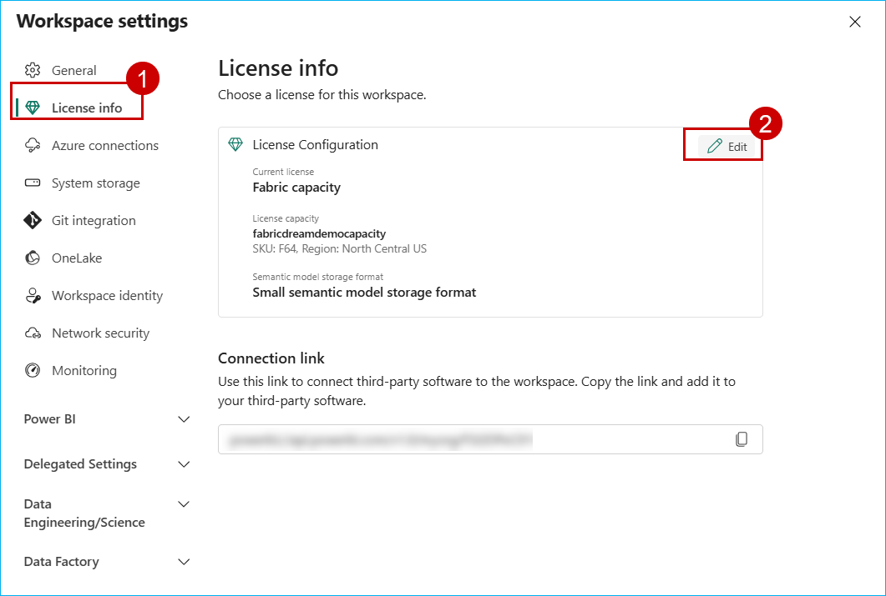
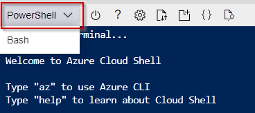
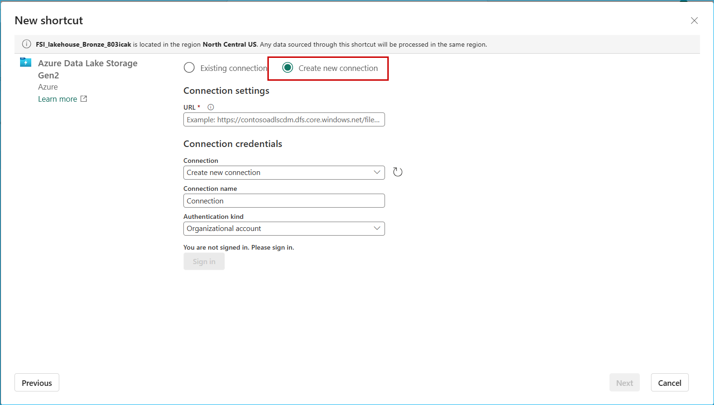
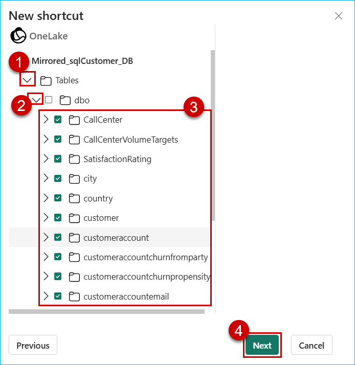
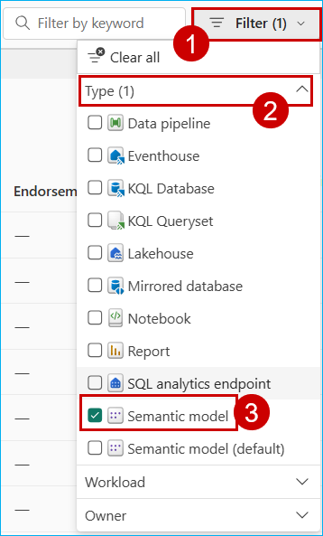
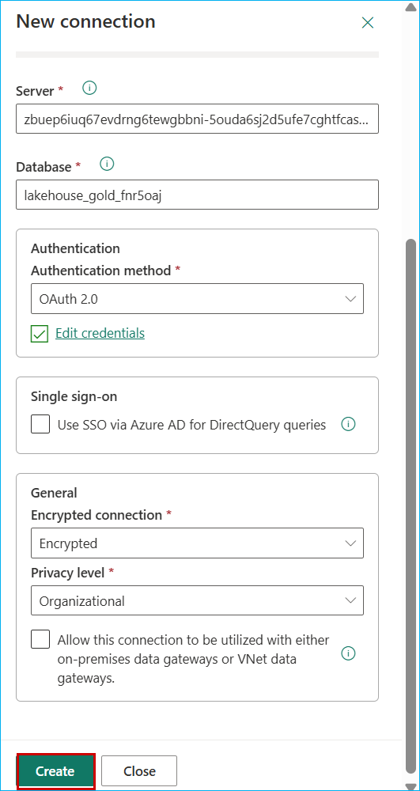
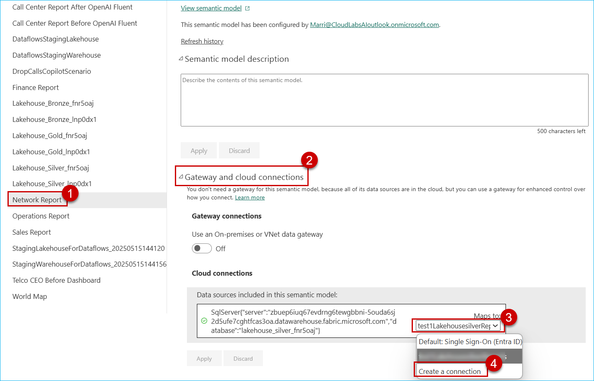
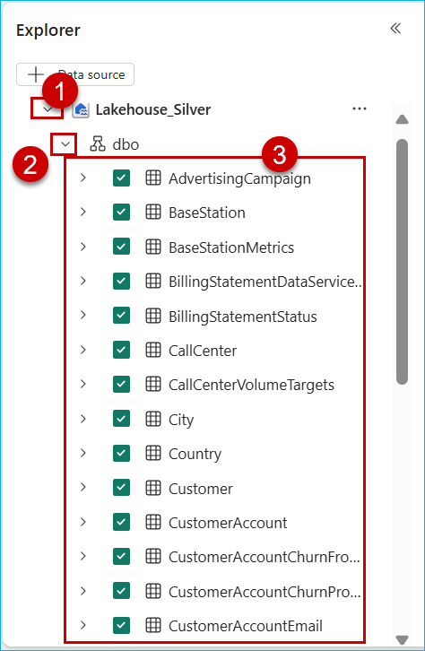

## What is DPoC?

DREAM PoC Accelerators (DPoC) are packaged DREAM Demos using ARM templates and automation scripts (with a demo web application, Power BI reports, Fabric resources, ML Notebooks, etc.) that can be deployed in a customer’s environment.

## Purpose & Vision

Partners can deploy DREAM Demos in their own Azure subscriptions and demonstrate them live to their customers.
Partnering with Microsoft sellers, partners can deploy the Industry scenario DREAM demos into customer subscriptions.
Customers can play, get hands-on experience navigating through the demo environment in their own subscription, and show it to their own stakeholders.

## :exclamation:IMPORTANT NOTES:

1. **Read the [license agreement](https://github.com/microsoft/Azure-Analytics-and-AI-Engagement/blob/main/CDP-Retail/license.md) and [disclaimer](https://github.com/microsoft/Azure-Analytics-and-AI-Engagement/blob/main/CDP-Retail/disclaimer.md) before proceeding, as your access to and use of the code made available hereunder is subject to the terms and conditions made available therein.**
2. Without limiting the terms of the [license](https://github.com/microsoft/Azure-Analytics-and-AI-Engagement/blob/main/CDP-Retail/license.md) , any Partner distribution of the Software (whether directly or indirectly) must be conducted through Microsoft’s Customer Acceleration Portal for Engagements (“CAPE”). CAPE is accessible to Microsoft employees. For more information regarding the CAPE process, contact your local Data & AI specialist or CSA/GBB.
3. It is important to note that **Azure hosting costs** are involved when DREAM PoC Accelerator is implemented in customer or partner Azure subscriptions. DPoC hosting costs are not covered by Microsoft for partners or customers.
4. Since this is a DPoC, there are certain resources available to the public. **Please ensure that proper security practices are followed before adding any sensitive data to the environment.** To strengthen the environment's security posture, **leverage Azure Security Centre.**
5. In case of questions or comments; please email **[dreamdemos@microsoft.com](mailto:dreamdemos@microsoft.com).**

# Copyright - 2025

© 2025 Microsoft Corporation. All rights reserved.

By using this demo/lab, you agree to the following terms:

The technology/functionality described in this demo/lab is provided by Microsoft Corporation for purposes of obtaining your feedback and to provide you with a learning experience. You may only use the demo/lab to evaluate such technology features and functionality and provide feedback to Microsoft. You may not use it for any other purpose. You may not modify, copy, distribute, transmit, display, perform, reproduce, publish, license, create derivative works from, transfer, or sell this demo/lab or any portion thereof.

COPYING OR REPRODUCTION OF THE DEMO/LAB (OR ANY PORTION OF IT) TO ANY OTHER SERVER OR LOCATION FOR FURTHER REPRODUCTION OR REDISTRIBUTION IS EXPRESSLY PROHIBITED.

THIS DEMO/LAB PROVIDES CERTAIN SOFTWARE TECHNOLOGY/PRODUCT FEATURES AND FUNCTIONALITY, INCLUDING POTENTIAL NEW FEATURES AND CONCEPTS, IN A SIMULATED ENVIRONMENT WITHOUT COMPLEX SET-UP OR INSTALLATION FOR THE PURPOSE DESCRIBED ABOVE. THE TECHNOLOGY/CONCEPTS REPRESENTED IN THIS DEMO/LAB MAY NOT REPRESENT FULL FEATURE FUNCTIONALITY AND MAY NOT WORK THE WAY A FINAL VERSION MAY WORK. WE ALSO MAY NOT RELEASE A FINAL VERSION OF SUCH FEATURES OR CONCEPTS. YOUR EXPERIENCE WITH USING SUCH FEATURES AND FUNCTIONALITY IN A PHYSICAL ENVIRONMENT MAY ALSO BE DIFFERENT.

## Contents

<!-- TOC -->

- [Pre-requisites](#Pre-requisites)
- [Task 1: Power BI Workspace creation](#task-1-power-bi-workspace-creation)
- [Task 2: Run the Cloud Shell to provision the demo resources](#task-2-run-the-cloud-shell-to-provision-the-demo-resources)
- [Task 3: Creating a Shortcut in a Lakehouse](#task-3-creating-a-shortcut-in-a-lakehouse)

- [Task 4: Executing Notebooks](#task-4-executing-notebooks)

- [Task 5: Get data into Eventhouse](#task-5-get-data-into-eventhouse)

- [Task 6: Updating Semantic Models with Cloud Connection](#task-6-updating-semantic-models-with-cloud-connection)
- [Task 7: Creating Semantic Model for Power BI Copilot](#task-7-creating-semantic-model-for-Power-BI-copilot)

- [Task 8: Creating Data Agent](#task-8-creating-data-agent)

<!-- /TOC -->

## Pre-requisites

- An Azure Account with the ability to create Fabric Workspace.
- A Power BI with Fabric License to host Power BI reports.
- Make sure the user deploying the script has at least a 'Contributor' level of access on the 'Subscription' on which it is being deployed.
- Make sure your Power BI administrator can provide service principal access on your Power BI tenant.
- Make sure to register the following resource providers with your Azure Subscription:
  - Microsoft.Fabric
  - Microsoft.SQLSever
  - Microsoft.StorageAccount
  - Microsoft.AppService
  - Microsoft.Azure Cosmos DB account
- You must only execute one deployment at a time and wait for its completion. Running multiple deployments simultaneously is highly discouraged, as it can lead to deployment failures.
- Select a region where the desired Azure Services are available. If certain services are not available, deployment may fail. See [Azure Services Global Availability](https://azure.microsoft.com/en-us/global-infrastructure/services/?products=all) for understanding target service availability (Consider the region availability for Synapse workspace, Iot Central and cognitive services while choosing a location).

* Choose the subscription where all the features listed above are available. As of 17-07-2024 eastus, eastus2, westus are having all the required features.

- In this Accelerator, we have converted real-time reports into static reports for the user's ease, but have covered the entire process to configure real-time datasets. Using those real-time datasets, you can create real-time reports.
- Make sure you use the same valid credentials to log into Azure and Power BI.

- Review the [License Agreement](https://github.com/microsoft/Azure-Analytics-and-AI-Engagement/blob/main/CDP-Retail/license.md) before proceeding.

> **Note:** This demo contains Power BI Copilot, pre-requisites of which can be found [HERE](https://github.com/microsoft/Azure-Analytics-and-AI-Engagement/blob/microsoftfabric/fabric/PowerBI%20Copilot/PowerBI%20Copilot%20Pre-requisites.md)

<!-- ## Enable PowerBI Tenant Settings

1. Navigate to https://app.powerbi.com/home?experience=power-bi

2. Click on **Settings** and select **Admin portal**.


3. Search for **service principal** and enable **Service principals can use Fabric APIs** then apply the settings for **Entire organization**. Click on the **apply** button.

 -->

### Task 1: Power BI Workspace creation

1. Click [HERE](https://app.powerbi.com/) to open **Power BI**.

2. **Sign** into Power BI.

   

   > **Note:** Use your Azure Active Directory credentials to login to Power BI.

3. In **Power BI** service, click on **Workspaces**.

4. Click the **+ New workspace** button.

   

5. Enter the name **Telco-Demo** and click the **Apply** button.

> If name 'Telco' is already taken, add a suffix to the end of the name. For example: **Telco-DemoTest**.

> Do not include spaces in the Workspace name.


6. Copy the **Workspace GUID/ID** from the address URL.

7. **Save** the **GUID** in a notepad for future reference.

   

   > **Note:** This workspace ID will be used during Powershell script execution.

8. In the workspace, click on **Workspace settings**.

   

9. In the left pane of the side bar, click on **License info**, and click on **Edit**.

   

10. Check the **Trial** radio box.


> **Note:** If your workspace have **Fabric capacity**, select it or else use 'Trial' License type.
> **Note:** We recommend you to use Fabric Capacity for better experience.

11. **Scroll down** and click on **Select license**.

    

> **Note:** Make sure to add this workspace as a Fabric Trial/Fabric capacity License and note down the names of the **Workspace** and **Lakehouses**. These will be used during script execution (Task 2).

### Task 2: Run the Cloud Shell to provision the demo resources

For this Demo, we have assets in an Azure resource group as well as Fabric Workspace. In this task, we will execute a Powershell script on Cloudshell to create those assets.

**List of the resources are as follows:**

**Azure resources:**
| <span style="color:#00A4EF;">NAME</span> | <span style="color:#00A4EF;">TYPE</span> |
|-----|-----|
|mssql{suffix} |SQL server |
|SalesDb (mssql{suffix}/SalesDb) |SQL database |
|sttelco{suffix} |Storage account |
|app-telcowebapp-{suffix}|App Service |
|asp-telcowebapp-{suffix} |App Service Plan |
|accounts-cog-telco-{suffix} |Azure AI services multi-service account |
| | |

**Fabric resources:**
| <span style="color:#00A4EF;">DisplayName</span> | <span style="color:#00A4EF;">TYPE</span> |
|-----------|------|
|lakehouse*Bronze*{suffix} |Lakehouse|
|lakehouse*Bronze*{suffix} | SemanticModel|
|lakehouse*Bronze*{suffix} | SQLEndpoint|
|lakehouse*Silver*{suffix} | Lakehouse|
|FSI*lakehouse_Silver*{suffix} | SemanticModel|
|FSI*lakehouse_Silver*{suffix} | SQLEndpoint|
|FSI*lakehouse_Gold*{suffix} | Lakehouse|
|FSI*lakehouse_Gold*{suffix} | SemanticModel|
|FSI*lakehouse_Gold*{suffix} | SQLEndpoint|
|Sales_Lakehouse | Lakehouse|
|Sales_Lakehouse |SemanticModel|
|Sales_Lakehouse | SQLEndpoint|
|World Map | Report|
|Telco CEO Before Dashboard | Report|
|Sales Report | Report|
|Operations Report | Report|
|Network Report | Report|
|Finance Report | Report|
|Call Center Report Before OpenAI Fluent | Report|
|Call Center Report After OpenAI Fluents | Report|
|World Map | Semantic model|
|Telco CEO Before Dashboard | Semantic model|
|Sales Report | Semantic model|
|Operations Report | Semantic model|
|Network Report | Semantic model|
|Finance Report | Semantic model|
|Call Center Report Before OpenAI Fluent | Semantic model|
|Call Center Report After OpenAI Fluent | Semantic model|
| 00 Create_Table_Structure_Bronze | Notebook|
| 01 Load_Data_Bronze | Notebook|
| 02 Load_Data_Silver_Layer | Notebook|
|03 Load_Data_Gold_Layer | Notebook|
|Eventhouse-Real-Time_Data | Eventhouse|
|Eventhouse-Real-Time_Data | KQLDatabase|
| | |

1. Open the **Azure Portal** using this link.

<a href="https://portal.azure.com/" target="_blank">  </a>

2. In the Azure portal, select the **Terminal** icon to open **Azure Cloud Shell**.

   

3. Click on the **PowerShell**.

   

4. Select **No Storage account required**, **Subscription** and then Click on **Apply** button.

   

5. In the **Azure Cloud Shell** window, ensure that the **PowerShell** environment is selected.

   

   > **Note:** All the cmdlets used in the script work best in Powershell.

   > **Note:** Please use 'Ctrl+C' to copy and 'Shift+Insert' to paste, as 'Ctrl+V' is NOT supported by CloudShell.

6. Enter the following command to clone the repository files in cloudShell.

```
git clone https://daidemos@dev.azure.com/daidemos/DREAMDemos/_git/DREAMPoC -b telcodpoc

git clone -b "Telco-Analytics-POC-Accelerator" --depth 1 --single-branch https://github.com/microsoft/Azure-Analytics-and-AI-Engagement.git "Telco-Analytics-POC-Accelerator"

```


> **Note:** If you get **File already exist.** error, please execute the following command to delete existing clone and then reclone:

```
 rm Telco-Analytics-POC-Accelerator -r -f
```

> **Note**: When executing scripts, it is important to let them run to completion. Some tasks may take longer than others to run. When a script completes execution, you will be returned to a command prompt.

7. Execute the **PowerShell** script with the following commands:

```
cd Telco-Analytics-POC-Accelerator/Telco-Analytics-POC-Accelerator
```

```
./telcoSetup.ps1
```


8. Enter **Y** and then click on Enter.

   

9. From the Azure Cloud Shell, copy the **authentication code**. You will need to enter this code in next step.

10. Click the link [https://microsoft.com/devicelogin](https://microsoft.com/devicelogin) and a new browser window will launch.

    

11. Paste the **authentication code**.

    

12. Select the **user account** that is used for logging into the **Azure Portal** in [Task 1](#task-1-create-a-resource-group-in-azure).

    

13. Click on **Continue** button.

    

14. Close the **browser tab** when you see the following message box.

    

15. Navigate back to your **Azure Cloud Shell** execution window.

16. Copy your **subscription name** from the screen and **paste** it in the prompt.

    

    > **Notes:**
    >
    > - Users with a single subscription won't be prompted to select a subscription.
    > - The subscription highlighted in yellow will be selected by default, if you do not enter a disired subscription. Please select the subscription carefully as it may break the execution further.
    > - While you are waiting for the processes to complete in the Azure Cloud Shell window, you'll be asked to enter the code four times. This is necessary for performing the installation of various Azure Services and preloading the data.

17. Copy the **code** on the screen to authenticate the Azure PowerShell script for creating reports in **Power BI**.

18. Click the link [https://microsoft.com/devicelogin](https://microsoft.com/devicelogin).

    

19. A new browser window will launch.

20. Paste the **authentication code** you copied from the shell above.

    

21. Select the **user account** that is used for logging into the Azure Portal in [Task 1](#task-1-create-a-resource-group-in-azure).

    

22. Click on **Continue**.

    

23. Close the **browser tab** once you see the message box.

    

24. Go back to **Azure Cloud Shell** execution window.

25. Copy the **code** on screen to authenticate the Azure PowerShell script for creating reports in **Power BI**.

26. Click the link [https://microsoft.com/devicelogin](https://microsoft.com/devicelogin).

    

27. A new browser window will launch.

28. Paste the **authentication code** you copied from the shell above.

    

29. Select the **user account** that is used for logging into the Azure Portal in [Task 1](#task-1-create-a-resource-group-in-azure).

    

30. Click on **Continue**.

    

31. Close the **browser tab** once you see the message box.

    

32. Go back to **Azure Cloud Shell** execution window.

33. Enter the **Region** for deployment with the necessary resources available, preferably **"eastus"** (Ex.: eastus, eastus2, westus, westus2, etc).

    

34. Enter the **Workspace ID** which you copied in [Task 1](#task-1-power-bi-workspace-and-lakehouse-creation) consecutively.


35. Enter your desired **SQL Password**.

    

> **Note:** Copy the password in Notepad for further reference.

36. You will get another code to authenticate the Azure PowerShell script for creating reports in Power BI. copy the code.

    > **Note:** You may see errors in script execution if you do not have necessary permissions for cloudshell to manipulate your Power BI workspace. In that case, follow this document [Power BI Embedding](https://github.com/microsoft/Azure-Analytics-and-AI-Engagement/blob/fintax/fintaxdemo/Power%20BI%20Embedding.md) to get the necessary permissions assigned. You’ll have to manually upload the reports to your Power BI workspace by downloading them from this location [Reports](https://github.com/microsoft/Azure-Analytics-and-AI-Engagement/tree/fintax/fintaxdemo/artifacts/reports).

37. click the link [https://microsoft.com/devicelogin](https://microsoft.com/devicelogin).

    

38. In the new browser tab, paste the **code** you copied from the shell in step 30 and click on **Next** button.

    

    > **Note:** Be sure to provide the device code before it expires and let the script run until completion.

39. Select the **user account**, you used to log into the **Azure Portal** in [Task 1](#task-1-create-a-resource-group-in-azure).

    

40. click on **Continue**.

    

41. Close the **browser tab** when you see the message box.

    

    > **Note:** During script execution, you need to note the resource group which gets created, since a resource group with unique suffix is created each time the script is executed.

42. After script execution is complete, the **"--Execution Complete--"** prompt appears.

### Task 3: Creating a Shortcut in a Lakehouse

1. Open [Power BI](app.powerbi.com).

2. In Power BI, click on **Workspaces** and **select** the **Telco-Demo** workspace.

   

3. In **Telco Demo** workspace, click on the **Lakehouse*Bronze*...** lakehouse.

   

> **Note:** Lakehouses will have a concatenated random suffix, resulting in names like 'Lakehouse_Bronze_2131awe4' for example.

4. In the lakehouse window, click on the **Collapse** icon in front of **Files**, if it is expanded.

> **Note:** When the **Collapse** icon is expanded, the three dots(ellipsis) icon is note visible.

5. Click on the three dots in front of **Files**.

6. Click on **New shortcut**.

   

7. In the pop-up window, under **External sources**, select the **Azure Data Lake Storage Gen2** option.

   

8. In a new tab, open the **resource group** created in [Task 2](#task-2-run-the-cloud-shell-to-provision-the-demo-resources) with name 'rg-telco-...'.

9. Click the **storage account resource**.

   

10. In the resource window, go to the **left pane** and scroll down.

11. In the **Security + networking** section, click on **Access keys**.

12. click on the **Show** button under **key1**.

    

13. click on **Copy** icon next to **Key**.

14. **Save** it in a notepad for further use.

    

15. **Scroll down** in the left pane.

16. Select **Endpoints** from the **Settings** section.

17. **Scroll down** and copy the **'Data Lake Storage'** endpoint under the 'Data Lake Storage' section.(Save it in a **notepad** for further use)

    

> **Note:** You may see different endpoints as well in the above screen. Make sure to select only the Data Lake Storage endpoint.

18. Navigate back to the **Power BI workspace** (the power bi tab which we working in earlier).

19. Select **Create New Connection**.

    

20. Paste the **endpoint** copied under the **URL** field.

21. In the **Authentiation kind** dropdown, select the **Account Key**.

22. Paste the **account key** copied in **step number 13**.

23. Click on **Next** button.

    

24. Expand **data** ,Select **network_datastore_adls** and click on **Next** button.


25. Click the **Create** button.

    

26. Repeat steps 1–25 to create a shortcut for **Lakehouse_Silver...** In step 3, click on Lakehouse_Silver..., and in step 25, select **sales_datastore_sql**.

    

    

### Creating Tables Shortcut

> **Note:** Be in the **Lakehouse*silver*...**

1. Expand **Tables**,Click on the three dots in front of **dbo**.

2. Click on **New table shortcut**.

   

3. Click on **Microsoft OneLake**.

   

4. Click on **Mirrored_sqlCustomer_DB** and then click on **Next** button.

   

5. Expand **Tables**, expand **dbo** and **select** all the tables inside **dbo** and then click on **Next** button.

   

6. Click on **Create** button.

   

### Task 4: Excecuting Notebooks

<!-- ### Creating a new Runtime

1. In the workspace click on the "01 Raw Data to Lakehouse (Bronze) Code First Experience" notebook.

	

2. click on the 'Environment' and **select** 'New Environment'.

    

3. Enter name for environment as 'salesEnvironment'

	 -->

### Running Notebooks

1. In the workspace **Filter** for **Notebook** and then click on the **00 Create_Table_Structure_Bronze.ipyn** notebook.

   

2. In the left pane, click on the **three dots(ellipsis)** and then select **Remove all sources**.

   

<!-- >**Note:** In case you do not see Missing lakehouse, you would see 'lakehouse{Name}', click on the same to get the 'Remove all Lakehosues' option. -->

3. Click on **Continue** in the pop-up window.

   

4. In the left pane, click on the **Add data items** button and then click on **Existing data sources**.

   

5. Click on **lakehouse*Bronze*..** checkbox and click on **Connect**.

   

6. Similarly, perform **step number 1 to step number 5** for the other notebooks as well.

> **Note:** To perform the above steps, you need to attach the notebooks to respective Lakehouses before running the Notebooks. Follow the instructions for the same.

7. Refer the following table to attach Notebooks with the respective Lakehouses.

   | Notebook                               | Lakehouse       |
   | -------------------------------------- | --------------- |
   | 00 Create_Table_Structure_Bronze.ipynb | lakehouseBronze |
   | 01 Load_Data_Bronze.ipynb              | lakehouseBronze |
   | 02 Load_Data_Silver_Layer.ipynb        | lakehouseSilver |
   | 03 Load_Data_Gold_Layer.ipynb          | lakehouseGold   |
   |                                        |                 |

8. Click on **Workspaces** and select the **Telco-Demo** workspace.


9. In the workspace, click on the **00 Create_Table_Structure_Bronze** notebook.

   

10. Click on the **Run all** button.

    

> **Note:** Click on **Run all** for each and every Notebook based on pre-numbers of the name of the notebook to complete the above steps for all the Notebooks.

### Task 5: Get data into Eventhouse

1. Navigate to the **Microsoft Fabric** tab on your browser (https://app.fabric.microsoft.com).

2. Search for **Eventhouse-Real-Time-Data** and click on it.


3. Under **KQL databases**, click on **Eventhouse-Real-Time-Data**.


4. Click on **Get Data**.


5. Click on **Azure Storage**


6. Click on **New table**.


7. Paste the name of the table as `telcoTelemetry`.


8. Go back to the **Azure portal**, re-direct to Resource group created, search for **Storage account**, and click on **storage account**.


9. Click on **Containers**.


10. Click on **kqldbdata**


11. Scroll to the right and click on three dots(ellipsiss) of **telcotelemetry.json** , and then click on **Generate SAS**.


12. Scroll down and click on **Generate SAS Token and URL**, Copy the **Blob SAS URL**.


13. Go back to the **Fabric** tab, disable **Continuous ingestion**, select **Use a SAS URL to ingest from a storage account** ,paste the URL in the **Enter SAS URL** section and click on **ADD** icon and then click on **Next** button.


14. Click on **Finish** button.


15. Click on **Close** button.


### Task 6: Updating Semantic models with Cloud connection

1. Open **Microsoft Fabric** tab on your browser.

2. Click on **Workspaces** and select **Telco-Demo**.


3. Click on **Filter** and select **Semantic model**.



4. Click on three dots(ellipsis) of **Semantic model** and click on **Settings**.


5. Expand **Gateway and cloud connections**, in the Cloud connections, click on dropdown and then select **Create a connection**.


6. Paste `GoldLakehouseReports` in the **Connection name** field, select **OAuth 2.0** in the **Authentication method** and then click on **Edit credentials**.


7. Select the **user account** that is used for logging into the **Azure Portal** in [Task 1](#task-1-create-a-resource-group-in-azure).

   

8. Click on **Create** button.



10. In the **Cloud connections**, click on dropdown, select **GoldLakehouseReports** and then click on **Apply** button.


11. Click on **Call Center Report Before OpenAI Fluent** semantic model from the list, expand **Gateway and Cloud connections** and in the **Cloud connections**, click on dropdown to select **LakehouseReports** and then click on **Apply** button.


12. Repeat **Step 11** for **Sales Report** semantic model.

13. For **Finance Report**, click on **Finance Report**,expand **Gateway and cloud connections**, in the Cloud connections, click on dropdown and then select **Create a connection**.


14. Paste `BronzeLakehouseReports` in the **Connection name** field, select **OAuth 2.0** in the **Authentication method** and then click on **Edit credentials**.


15. Select the **user account** that is used for logging into the **Azure Portal** in [Task 1](#task-1-create-a-resource-group-in-azure).

    

16. Click on **Create** button.


17. In the **Cloud connections**, click on dropdown, select **BronzeLakehouseReports** and then click on **Apply** button.


18. For **Network Report**, click on **Network Report**,expand **Gateway and cloud connections**, in the Cloud connections, click on dropdown and then select **Create a connection**.



19. Paste `SilverLakehouseReports` in the **Connection name** field, select **OAuth 2.0** in the **Authentication method** and then click on **Edit credentials**.


20. Select the **user account** that is used for logging into the **Azure Portal** in [Task 1](#task-1-create-a-resource-group-in-azure).

    

21. Click on **Create** button.


22. In the **Cloud connections**, click on dropdown, select **SilverLakehouseReports** and then click on **Apply** button.


23. For **Operation Report** , **World Map**, expand **Gateway and cloud connections**, in the **Cloud connections**, click on dropdown. select **SilverLakehouseReports** and then click on **Apply** button.


24. For **Telco CEO Before Dashboard** report repeat **Step 23**.


25. For **Telco CEO Before Dashboard** report, expand **Parameters** and then copy the **KQLCluster** , **KQLEventHouse** values.


26. In the Cloud connections, click on dropdown and then select **Create a connection** for mapping the KQL connection.


27. Paste `KQLReports` in the **Connection name**, paste **KQLCluster** , **KQLEventHouse** values copied in **Step 25**, select **OAuth 2.0** in the **Authentication method** and then click on **Edit credentials**.


15. Select the **user account** that is used for logging into the **Azure Portal** in [Task 1](#task-1-create-a-resource-group-in-azure).

    

16. Click on **Create** button.

17. In the **Cloud connections**, click on dropdown, select **kqltoReports** and then click on **Apply** button.


### Task 7: Creating Semantic Model for Power BI Copilot

1. Open **Microsoft Fabric** tab on your browser.

2. Click on **Workspaces** and select **Telco-Demo**.


3. Click on **Filter** to select **Lakehouse**.


4. Click on the **Lakehouse_Silver...**.

> **Note:** There are three options for Lakehouse, namely Lakehouse, Semantic model (Default) and SQL endpoint. Ensure to select the **Lakehouse** option.


5. Click on the **New semantic model** button.


6. In the **Name** field, paste `DropCallsCopilotScenario`.

7. Select workspace as **Telco-Demo** and click on **Expand** icon next to **dbo** checkbox.


8. Click on **Expand** icon next to **Tables** checkbox.


9. Scroll down and select **telcocopilot** table and then click on the **Confirm** button.


10. Wait for few seconds to see Semantic model on the following page:


### Task 8: Creating Data agent

> This task only work if you selected Fabric Capacity Licence in Task1.

1. Open **Microsoft Fabric** tab on your browser.

2. Click on **Workspaces** and select **Telco-Demo**.


3. Click on **+ New item**, search for `Data agent` and click on **Data agent**.


4. Paste `TelcoAssistance` in the name field and click on **Create**.


5. Click on **+ Data source**.


6. Click on **lakehouse*Silver*..** checkbox and click on **Connect**.


7. Expand **Lakehouse*Silver*..** , expand **dbo** and then select all the tables.



8. Click on **AI instructions** and then paste following instructions in it.

```
This model integrates customer, campaign, call center, and financial data to generate insights. Key joins include Customer.CustomerId → CustomerSatisfactionRating.CustomerId for satisfaction metrics, AdvertisingCampaign.ProductId → WirelessProduct.ProductId for campaign analysis, and BillingStatementDataServiceCharge.CustomerAccountId → CustomerAccount.CustomerAccountId for financial metrics. Use CallCenter.CallCenterId → CallCenterVolumeTargets.CallCenterId to track target vs. actual call volumes. KPIs include churn rate (CustomersLeft / NetOpenCustomers), retention rate, expense variance, and NPS. Aggregate metrics like revenue (BillingStatementDataServiceCharge.ChargeAmount) and satisfaction scores with GROUP BY on relevant dimensions like state or city. Ensure proper date filters for time-based queries.
```


